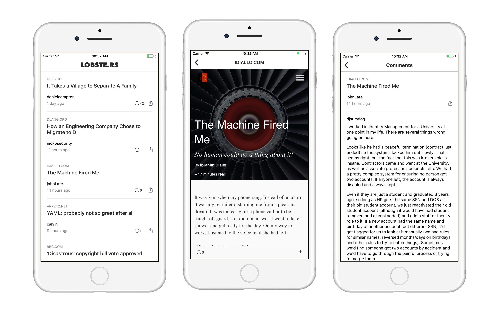

## LobstersApp
iOS app for reading Lobsters (https://lobste.rs/) stories and comments. Written in Swift.

## API
There is no official API from [Lobsters](https://lobste.rs/). However in their [Rails source code](https://github.com/lobsters/lobsters) I found some end points the site will respond with JSON data which I use in the app:
- `https:/lobste.rs?page=#{page}` - Returns links (aka stories) for a specified page number.
- `https:/lobste.rs/s/#{story_id}` - Returns all comments for a story (specified by story id).

All you have to do is set the Accept header's value to `application/json` in your requests.

## License
MIT
